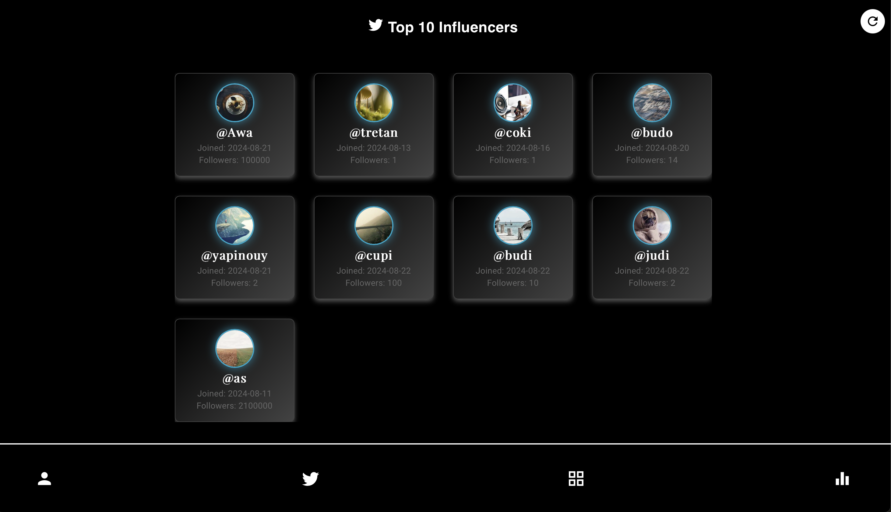
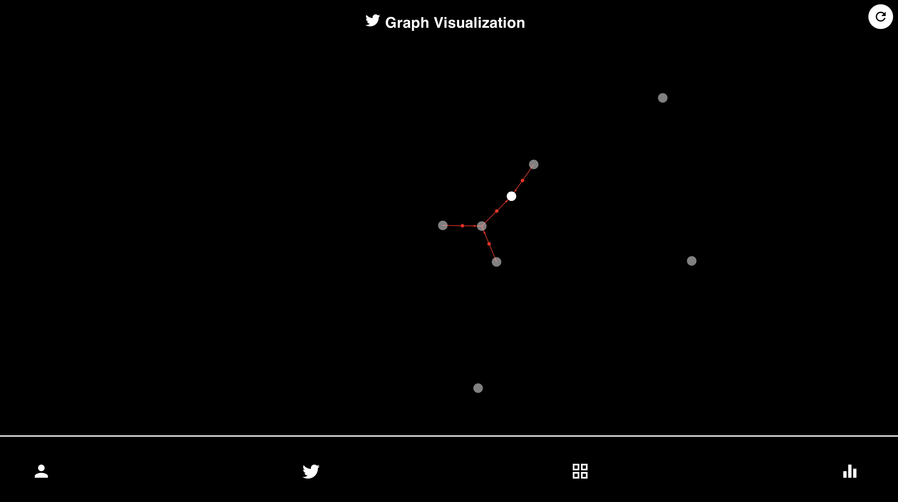
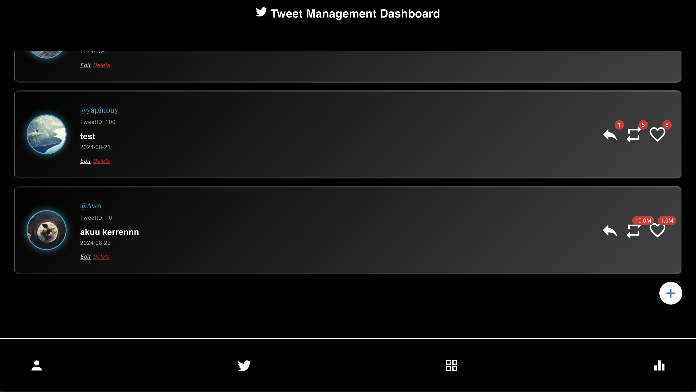
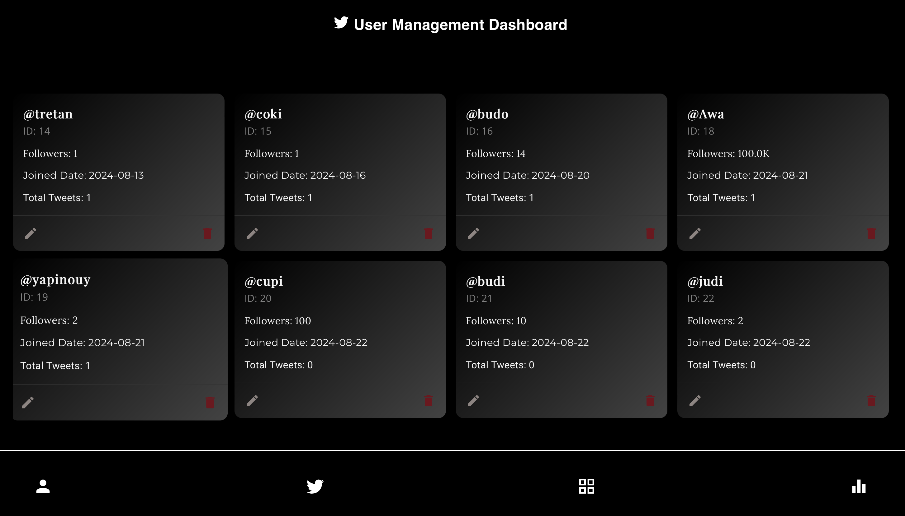
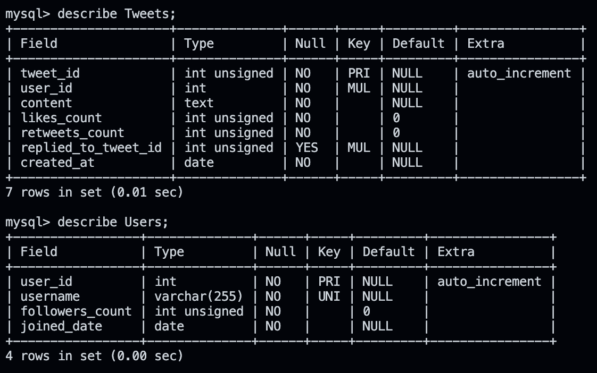

# Social Network Influencer Detector

In the digital time, social media has become a key platform for communication and information sharing. Beyond just being a social interaction platform, social media is a powerful arena where individuals or groups can shape public opinion, trends, and even major decisions. A major challenge in understanding social networks is identifying who truly has significant influence.

Using the concept of Eigenvector Centrality, the Influencer Detector application is designed to identify individuals with the greatest influence in a social network. Eigenvector Centrality measures not only how well-connected a node is but also the importance of those connections, providing a more accurate picture of who is genuinely influential.

This web-app is designed to analyze social networks and identify key influencers by leveraging Eigenvector Centrality and managing every user data including his tweets.


## Technologies, Languages, and Frameworks

Backend

	•	Language: JavaScript (Node.js)
	•	Frameworks/Libraries: Express.js, MySQL2
	•	Algorithm: Eigenvector Centrality

Frontend

	•	Language: JavaScript (React)
	•	Frameworks/Libraries: Material-UI, Axios

 
## Program Structure

Here’s an overview of the program structure:

 ```bash
/Social-Network-Influencer-Detector
|-- /backend
|   |-- /src
|   	|-- /controllers
|   	|-- /models
|   	|-- /routes
|   	|-- /services
|   	|-- /config
|   |-- server.js
|   |-- app.js
|   |-- .env
|-- /frontend
|   |-- /src
|	|-- /assets
|   	|-- /components
|		|-- /layout
|   	|-- /pages
|   	|-- /utils
|   |-- App.js
|   |-- index.js
|-- README.md
|-- package.json

```

## [Backend] Algorithm Components

**Eigenvector Centrality Explanation**

Eigenvector Centrality is a measure used in graph theory to determine the influence of a node in a network. It considers not only the number of connections a node has but also the quality and influence of those connections.

**Application of Eigenvector Centrality in Influencer Detection**

The Eigenvector Centrality algorithm is applied to detect influencers by evaluating the influence of users based on their connections and interactions. This helps identify key influencers within a network.

**Influence Factors Used**

	•	Followers Count: The number of followers a user has.
	•	Joined Date: The date the user joined the platform.
	•	Tweet Count: The total number of tweets made by the user.
	•	Likes Received: Total likes received on the user’s tweets.
	•	Retweets Received: Total retweets received on the user’s tweets.
	•	Replies Received: Number of replies to the user’s tweets.
	•	Adjacency Matrix: Representation of connections between users based on tweet interactions.

**Weights Used**

	•	Followers Count: 0.1
	•	Joined Date: 0.1
	•	Tweet Count: 0.1
	•	Likes Received: 0.2
	•	Retweets Received: 0.2
	•	Replies Received: 0.2
	•	Adjacency Matrix Influence: 0.1

**Example Cases, Calculation Process, and Results**

	•	Example Case: User A interacts with User B by replying to their tweet. This interaction is recorded in the adjacency matrix.
	•	Calculation Process: Eigenvector Centrality is calculated based on the weighted influence factors and adjacency matrix.
	•	Results: Users are ranked based on their influence scores, helping to identify the most influential users.

**Algorithm Analysis**
Time Complexity: The time complexity primarily depends on the matrix multiplication and eigenvalue computation. For large matrices, algorithms like power iteration or Lanczos method are often used, which can be more efficient than direct computation. Generally, matrix operations have a time complexity of  O(n^3)  for dense matrices, where  n  is the number of nodes.
Space Complexity: The space complexity is  O(n^2)  for storing the adjacency matrix and  O(n)  for the eigenvector. Sparse matrix representations can reduce space requirements.


## [Frontend] Frontend Components

**How to Run the Program**
- Clone the repository: git clone <repository-url>
- Navigate to the frontend directory: cd frontend
- Install dependencies: npm install
- Start the application: npm start
- Open the website's frontend on : localhost:3000


**List of Created Pages and Their Purposes**
- Dashboard Page : Shows top 10 users based on its calculations
- User Management Page: Allows users CRUD the list of existing users from the database
- Tweet Management Page: Allows users CRUD the list of existing tweets from the database
- Graph Visualization Page : Show users the visualization of every user's relationship

## Screenshots

<div style="display: flex; flex-wrap: wrap; justify-content: space-around;">
    <div style="margin: 10px;">
        
        <p>Dashboard Page</p>
    </div>
    <div style="margin: 10px;">
        
        <p>Graph Visualization</p>
    </div>
    <div style="margin: 10px;">
        
        <p>Tweets Management</p>
    </div>
    <div style="margin: 10px;">
        
        <p>Users Management Page</p>
    </div>
</div>

## [Backend] Backend Components

**How to Run the Program**

- Clone the repository: git clone <repository-url>
- Navigate to the backend directory: cd backend
- Install dependencies: npm install
- Set up environment variables in a .env file.
- Start the server: npm start
- Open the website's backend on : localhost:5001

**List of Created Endpoints**

Tweets
```bash
	1.	Get All Tweets
	•	Endpoint: GET /tweets
	•	Description: Retrieves all tweets from the database.
	•	Response: JSON array of tweets.
	2.	Get All Tweets with User Information
	•	Endpoint: GET /tweetswithuser
	•	Description: Retrieves all tweets along with associated user information.
	•	Response: JSON array of tweets with user details.
	3.	Get Tweet by ID
	•	Endpoint: GET /tweets/:id
	•	Description: Fetches a specific tweet by its unique ID.
	•	Response: JSON object of the tweet, or 404 if not found.
	4.	Get Tweets by User ID
	•	Endpoint: GET /tweets/user/:user_id
	•	Description: Retrieves all tweets posted by a specific user.
	•	Response: JSON array of tweets by the specified user, or 404 if not found.
	5.	Create a New Tweet
	•	Endpoint: POST /tweets
	•	Description: Creates a new tweet with the provided details.
	•	Request Body: JSON object with user_id, content, likes_count, retweets_count, replied_to_tweet_id, and created_at.
	•	Response: JSON object of the newly created tweet.
	6.	Update an Existing Tweet
	•	Endpoint: PUT /tweets/:id
	•	Description: Updates the details of an existing tweet by its ID.
	•	Request Body: JSON object with user_id, content, likes_count, retweets_count, and replied_to_tweet_id.
	•	Response: JSON object of the updated tweet.
	7.	Delete a Tweet
	•	Endpoint: DELETE /tweets/:id
	•	Description: Deletes a specific tweet by its ID.
	•	Response: Status 204 if successfully deleted, or 404 if tweet not found.
```
Users
```bash
	1.	Get All Users
	•	Endpoint: GET /users
	•	Description: Retrieves all users from the database.
	•	Response: JSON array of users.
	2.	Get All Users with Tweets
	•	Endpoint: GET /userstweets
	•	Description: Retrieves all users along with their tweets.
	•	Response: JSON array of users with associated tweets.
	3.	Get User by ID
	•	Endpoint: GET /users/:id
	•	Description: Fetches a specific user by their unique ID.
	•	Response: JSON object of the user, or 404 if not found.
	4.	Create a New User
	•	Endpoint: POST /users
	•	Description: Creates a new user with the provided details.
	•	Request Body: JSON object with username, followers_count, and joined_date.
	•	Response: JSON object of the newly created user.
	5.	Update an Existing User
	•	Endpoint: PUT /users/:id
	•	Description: Updates the details of an existing user by their ID.
	•	Request Body: JSON object with username, followers_count, and joined_date.
	•	Response: JSON object of the updated user.
	6.	Delete a User
	•	Endpoint: DELETE /users/:id
	•	Description: Deletes a specific user by their ID.
	•	Response: Status 204 if successfully deleted, or 404 if user not found.


```
## [Backend] Database Components

**DBMS Used**

- Database Management System (DBMS): MySQL

**Database**


**Learning References**
[Watch video 1](https://www.youtube.com/watch?v=2bLD7yvy6jQ)
[Watch video 2](https://www.youtube.com/watch?v=-LO9NLaccFQ)
